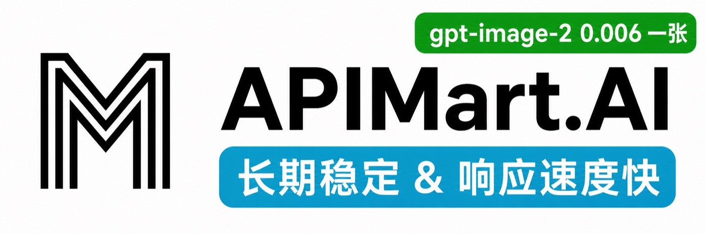

# CCG - Claude + Codex + Gemini Multi-Model Collaboration

<div align="center">


[](https://github.com/fengshao1227/ccg-workflow)
[](https://www.npmjs.com/package/ccg-workflow)
[](https://www.npmjs.com/package/ccg-workflow)
[](https://opensource.org/licenses/MIT)
[](https://github.com/fengshao1227/ccg-workflow/actions/workflows/ci.yml)
[](https://codecov.io/gh/fengshao1227/ccg-workflow)
[](https://claude.ai/code)
[](https://nodejs.org/)
[](https://x.com/CCG_Workflow)

[](https://ccg.fengshao1227.com/)
[](https://deepwiki.com/fengshao1227/ccg-workflow)

[简体中文](./README.zh-CN.md) | English | [**Documentation**](https://ccg.fengshao1227.com/)

</div>

## ♥️ Sponsor

[](https://go.apimart.ai/gh-ccg-workflow)

Thanks to [APIMart](https://go.apimart.ai/gh-ccg-workflow) for sponsoring this project! APIMart is a low-cost API platform for AI image & video generation — GPT-Image-2 from $0.006/image, 160+ images per dollar. One async API covers both image and video: submit a task, get an ID, fetch results via polling or callback. Batch tens of thousands of images without timeouts, switch models without changing code. Pay-as-you-go with no monthly fee — [sign up here](https://go.apimart.ai/gh-ccg-workflow) to get started.

> 💡 APIMart also exposes an Anthropic-compatible endpoint, so it can serve as your API provider for Claude Code itself — run `npx ccg-workflow`, pick APIMart at Step 1, and paste your key.

---

[](https://gammaremover.com/)

[Gamma Remover](https://gammaremover.com/) — Free browser-local Gamma watermark remover for PDF & PPTX. No signup, instant results, 100% private. Your files never leave your device.

---

## 🐳 CCG on DeepSeek Harness — `dsh-ccg`

The same role matrix, running natively inside [DeepSeek Harness](https://github.com/deepseek-ai/deepseek-harness). It ships **inside this package** — no second install, no second version to track.

```bash
npx ccg-workflow dsh install    # every profile found; --profile <name> for one
npx ccg-workflow dsh list       # which profiles have it
```

Or pick **`D. DeepSeek Harness`** from `npx ccg-workflow`.

Seven role-pinned delegation tools, each on its own model with its own expert persona — and two things the Claude Code side cannot do as cleanly:

- **Model panels.** Give one role several models and they all answer the same brief independently, rendered **side by side in the conversation**. Nothing votes, nothing is averaged — disagreement is the finding.
- **Live teammates.** `ccg_team` hires a role as a colleague that stays alive across turns, owns its own files (a colliding hire is *refused*, not warned about), and reports back on its own. Every hire asks you to approve it first.

No external CLI, no binary bridge, no cold-start tax — every hop is a provider API request. Source lives in [`dsh-ccg/`](./dsh-ccg); [full README →](./dsh-ccg/README.md)

## 🧩 Also by the author

**[DSH Marketplace](https://dshmarketplace.dev/)** — a directory of [DeepSeek Harness plugins](https://dshmarketplace.dev/plugins). 2,500+ indexed across 14 categories, bilingual EN / 中文.

Not a sponsor — same author as CCG, built out of a plain annoyance: DSH plugins are multiplying fast, but figuring out what one does, whether it still installs, and what the command actually is meant opening one GitHub README after another. So the install commands here are put through a throwaway container first. **A plugin only gets a check mark if it really installs — and if it can't, the listing says why** (buried in a monorepo subdirectory, never published to npm, and so on). A verified index, not another awesome list.

```bash
dsh plugin --profile web add dshmarketplace-plugin   # browse the store from inside DSH
npx dshmarketplace-cli add owner/repo                # install any plugin from your shell
```

There is also a [Python SDK](https://github.com/DshMarketPlace/dshmarketplace-py) and a [public API](https://dshmarketplace.dev/api-docs). Early days — bug reports and plugin submissions are very welcome on [GitHub](https://github.com/DshMarketPlace).

---

## What is CCG?

**CCG is a workflow engine for Claude Code.** It turns Claude into a multi-model orchestrator — Claude stays in control while dispatching specialized work to Codex (OpenAI), Grok (xAI), Kimi Code (Moonshot), and Antigravity through a Go binary bridge.

One command. Describe what you want. The engine handles the rest.

```bash
npx ccg-workflow    # Install in 60 seconds
```

## Architecture

<div align="center">

</div>

**Claude Code** is the lead orchestrator. It analyzes your intent, selects a strategy, and manages the entire workflow. The **Hook Engine** injects state every turn so Claude never loses context — even after compaction. The **codeagent-wrapper** (a compiled Go binary) bridges Claude to external models for parallel analysis and review.

## How It Works

```
You: /ccg:go add JWT authentication to this API

CCG Engine:
  1. Reads project context (git status, tech stack, file structure)
  2. Classifies: feature / L complexity / backend / high risk
  3. Selects strategy: full-collaborate
  4. Creates .ccg/tasks/add-jwt-auth/task.json
  5. Launches dual-model analysis (Codex + Gemini in parallel)
  6. Produces plan → HARD STOP for your approval
  7. Spawns Agent Teams Builders for parallel implementation
  8. Runs quality gates + dual-model cross-review
  9. Reports results

Every turn, a hook injects:
  <ccg-state>
  Task: add-jwt-auth (in_progress)
  Strategy: full-collaborate
  Phase: 4-implementation
  </ccg-state>
```

## 10 Built-in Strategies

The engine auto-selects the right strategy based on task type and complexity:

| Strategy | When | External Models | Agent Teams |
|----------|------|:---:|:---:|
| `direct-fix` | Simple bug, single file | — | — |
| `quick-implement` | Small feature, clear scope | — | — |
| `guided-develop` | Medium feature, needs planning | Single | — |
| `full-collaborate` | Complex feature, multi-module | Dual parallel | ✓ |
| `debug-investigate` | Complex bug, unknown cause | Dual diagnosis | — |
| `refactor-safely` | Code restructuring | Dual review | — |
| `deep-research` | Technical research | Dual exploration | — |
| `optimize-measure` | Performance optimization | Optional | — |
| `review-audit` | Code review | Dual cross-review | — |
| `git-action` | commit, rollback, branches | — | — |

Simple tasks run fast with zero overhead. Complex tasks get the full engine.

## Core Features

### Hook Engine — Never Lose Context

4 JavaScript hooks inject state into every Claude Code session:

| Hook | Event | What it does |
|------|-------|-------------|
| `workflow-state.js` | Every turn | Injects current task state as breadcrumb |
| `session-start.js` | Session start/compact | Re-injects full project context |
| `subagent-context.js` | Agent/Bash spawn | Injects spec directly into subagent prompts |
| `skill-router.js` | Every turn | Auto-injects domain knowledge by keyword |

Context survives compaction. Sub-agents born with spec in their prompt. Zero state loss.

### Task System — Persistent Lifecycle

Medium+ complexity tasks get a persistent directory:

```
.ccg/tasks/add-jwt-auth/
├── task.json         # Status, strategy, phase, gate
├── requirements.md   # Enhanced requirements
├── plan.md           # Approved implementation plan
├── context.jsonl     # Spec files for sub-agent injection
├── review.md         # Review results
└── research/         # Persisted research findings
```

### Quality Gates — Built-in Security & Quality

| Gate | Trigger |
|------|---------|
| `/ccg:verify-security` | New modules, security changes |
| `/ccg:verify-quality` | Changes > 30 lines |
| `/ccg:verify-change` | Doc sync check |
| `/ccg:verify-module` | Module structure check |
| `/ccg:gen-docs` | Auto-generate README + DESIGN |

### 100+ Domain Knowledge Files

When your message mentions security, caching, RAG, Kubernetes, etc., the relevant knowledge file is auto-injected. 10 domains, 61 files:

`Security` · `Architecture` · `DevOps` · `AI/MLOps` · `Development` · `Frontend Design` · `Infrastructure` · `Mobile` · `Data Engineering` · `Orchestration`

### Standalone Skills — battle-tested website workflows (v3.5.1)

Self-contained skills, each usable on its own or auto-triggered by intent. Drawn from real site-building work and shipped with their scripts:

| Skill | What it does |
|-------|-------------|
| `/ccg:bt-panel` | Drive a **BaoTa / aaPanel** server over its HTTP API — deploy a build, update a live site, read/write files, run shell, run MySQL. No SSH or rsync; just a panel URL + API key. Ships `bt_client.py` + one-shot `bt_deploy.py`. |
| `/ccg:seo-page-builder` | Build, audit, or optimize **SEO tool pages** (AI generator / remover / enhancer / converter / editor). SERP-intent driven, with a runnable `onpage-audit.py` keyword-density meter. |
| `/ccg:adsense-site-auditor` | Audit a site for **Google AdSense** readiness against the full official checklist — eligibility, ownership, content quality, ads.txt, privacy, Publisher Policies — before you apply or after a rejection. |

> `bt-panel` reads credentials only from env vars / a git-ignored `sites.json`; nothing is hardcoded. `seo-page-builder` is adapted from yuzeiki's skill of the same name (see its SKILL.md).

## Commands

### Core (v3.0 default: 13 commands)

| Command | Description |
|---------|-------------|
| `/ccg:go` | **Smart entry** — describe what you want, engine handles the rest |
| `/ccg:commit` | Smart conventional commit |
| `/ccg:rollback` | Interactive rollback |
| `/ccg:clean-branches` | Clean merged branches |
| `/ccg:worktree` | Worktree management |
| `/ccg:init` | Initialize project CLAUDE.md |
| `/ccg:context` | Project context management |

### OpenSpec Integration

| Command | Description |
|---------|-------------|
| `/ccg:spec-init` | Initialize OPSX environment |
| `/ccg:spec-research` | Requirements → constraints |
| `/ccg:spec-plan` | Constraints → zero-decision plan |
| `/ccg:spec-impl` | Execute plan + archive |
| `/ccg:spec-review` | Dual-model cross-review |

### Legacy Mode (18 additional commands)

Includes `/ccg:workflow`, `/ccg:plan`, `/ccg:execute`, `/ccg:frontend`, `/ccg:backend`, `/ccg:analyze`, `/ccg:debug`, `/ccg:optimize`, `/ccg:test`, `/ccg:review`, `/ccg:team`, and more.

## Quick Start

**Option A — full install (multi-model orchestration + commands + hooks + binary, recommended)**

```bash
# Install (interactive 4-step wizard)
npx ccg-workflow

# Or non-interactive with defaults
npx ccg-workflow init --skip-prompt
```

Requires **Node.js 20+** and **Claude Code CLI**. Codex CLI, Grok CLI, Kimi Code CLI, and Antigravity are optional (enable multi-model features).

**Option B — native plugin (skills only, zero dependencies, v3.5.1+)**

Want just the skills (web-ops toolkit, quality gates, frontend-design, domain knowledge) without the multi-model orchestration?

```bash
claude plugin marketplace add fengshao1227/ccg-workflow
claude plugin install ccg@ccg
```

Skills are invoked as `/ccg:<skill>`. No npx, no binary. The multi-model commands ship only through Option A (their templates carry install-time placeholders that a native plugin can't resolve).

## CLI Commands

```bash
npx ccg-workflow                          # Interactive menu
npx ccg-workflow init                     # 4-step install wizard
npx ccg-workflow doctor                   # Environment health check
npx ccg-workflow status                   # Installation overview
npx ccg-workflow codex-mode install       # Install Codex-Led mode
npx ccg-workflow codex-mode uninstall     # Uninstall Codex-Led mode
npx ccg-workflow dsh install              # Install CCG into DeepSeek Harness
npx ccg-workflow dsh list                 # Which dsh profiles have it
npx ccg-workflow dsh uninstall            # Remove it from every profile
npx ccg-workflow uninstall                # Uninstall CCG
npx ccg-workflow config mcp               # Configure MCP tokens
npx ccg-workflow diagnose-mcp             # Diagnose MCP issues
```

## Configuration

```
~/.claude/
├── commands/ccg/          # Slash commands
├── hooks/ccg/             # Hook scripts (5 files)
├── skills/ccg/            # Quality gates + 100+ domain knowledge
├── rules/                 # Auto-trigger rules
├── .ccg/
│   ├── config.toml        # Model routing, MCP, performance
│   ├── engine/            # 10 strategy files + model router
│   └── prompts/           # Expert prompts (codex/gemini/claude)
└── bin/codeagent-wrapper  # Multi-model bridge (Go binary)
```

### Environment Variables

Set in `~/.claude/settings.json` under `"env"`:

| Variable | Default | Description |
|----------|---------|-------------|
| `CODEX_TIMEOUT` | `7200` | Wrapper timeout (seconds) |
| `CODEAGENT_POST_MESSAGE_DELAY` | `5` | Post-completion delay |
| `CLAUDE_CODE_EXPERIMENTAL_AGENT_TEAMS` | unset | Set `1` for parallel Agent Teams |

## Update / Uninstall

```bash
npx ccg-workflow@latest     # Update to latest
npx ccg-workflow doctor     # Check health after update
npx ccg-workflow uninstall  # Clean uninstall
```

## Credits

- [cexll/myclaude](https://github.com/cexll/myclaude) — codeagent-wrapper inspiration
- [UfoMiao/zcf](https://github.com/UfoMiao/zcf) — Git tools reference
- [mindfold-ai/Trellis](https://github.com/mindfold-ai/Trellis) — Hook-based workflow state patterns
- [ace-tool](https://linux.do/t/topic/1344562) — MCP code retrieval

## Contributors

<!-- readme: contributors -start -->
<table>
<tr>
    <td align="center"><a href="https://github.com/fengshao1227"><br /><sub><b>fengshao1227</b></sub></a></td>
    <td align="center"><a href="https://github.com/SXP-Simon"><br /><sub><b>SXP-Simon</b></sub></a></td>
    <td align="center"><a href="https://github.com/RebornQ"><br /><sub><b>RebornQ</b></sub></a></td>
    <td align="center"><a href="https://github.com/Sakuranda"><br /><sub><b>Sakuranda</b></sub></a></td>
    <td align="center"><a href="https://github.com/Mriris"><br /><sub><b>Mriris</b></sub></a></td>
    <td align="center"><a href="https://github.com/23q3"><br /><sub><b>23q3</b></sub></a></td>
    <td align="center"><a href="https://github.com/MrNine-666"><br /><sub><b>MrNine-666</b></sub></a></td>
</tr>
<tr>
    <td align="center"><a href="https://github.com/GGzili"><br /><sub><b>GGzili</b></sub></a></td>
</tr>
</table>
<!-- readme: contributors -end -->

## Contact

- **X (Twitter)**: [@CCG_Workflow](https://x.com/CCG_Workflow)
- **Email**: [fengshao1227@gmail.com](mailto:fengshao1227@gmail.com)
- **Issues**: [GitHub Issues](https://github.com/fengshao1227/ccg-workflow/issues)
- **Community**: [Linux.do](https://linux.do)

## Star History

[](https://www.star-history.com/#fengshao1227/ccg-workflow&type=timeline&legend=top-left)

## License

MIT

---

v3.6.3 | [Issues](https://github.com/fengshao1227/ccg-workflow/issues) | [Contributing](./CONTRIBUTING.md)
