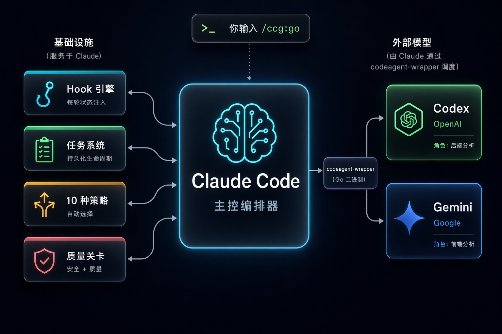

# CCG - Claude + Codex + Gemini 多模型协作

<div align="center">


[](https://github.com/fengshao1227/ccg-workflow)
[](https://www.npmjs.com/package/ccg-workflow)
[](https://www.npmjs.com/package/ccg-workflow)
[](https://opensource.org/licenses/MIT)
[](https://github.com/fengshao1227/ccg-workflow/actions/workflows/ci.yml)
[](https://codecov.io/gh/fengshao1227/ccg-workflow)
[](https://claude.ai/code)
[](https://nodejs.org/)
[](https://x.com/CCG_Workflow)

[](https://ccg.fengshao1227.com/)
[](https://deepwiki.com/fengshao1227/ccg-workflow)

[简体中文](./README.zh-CN.md) | [English](./README.md) | [**完整文档**](https://ccg.fengshao1227.com/)

</div>

## ♥️ Sponsor

[](https://go.apimart.ai/gh-ccg-workflow)

感谢 [APIMart](https://go.apimart.ai/gh-ccg-workflow) 赞助了本项目！APIMart 是专注 AI 图片/视频生成的低价 API 平台，GPT-Image-2 低至 $0.006/张，1 美元可出图 160+ 张。图片、视频一套异步 API 通吃，提交任务拿 ID、回调取结果，跑批万张不超时、换模型不改代码。按量付费、无月费，通过[此注册链接](https://go.apimart.ai/gh-ccg-workflow)注册即可开用。

> 💡 APIMart 同时提供 Anthropic 原生兼容端点，可直接作为 Claude Code 的 API 提供方 —— 运行 `npx ccg-workflow` 在 Step 1 选择 APIMart，填入 Key 即可。

---

[](https://gammaremover.com/)

[Gamma Remover](https://gammaremover.com/) — 免费浏览器本地 Gamma 水印去除工具。支持 PDF 和 PPTX，无需注册，即时出结果，100% 隐私，文件不离开你的设备。

---

## 🐳 CCG 的 DeepSeek Harness 形态 —— `dsh-ccg`

同一套角色矩阵，原生跑在 [DeepSeek Harness](https://github.com/deepseek-ai/deepseek-harness) 里。它**随本包一起发**，不用装第二个东西，也没有第二个版本号要对。

```bash
npx ccg-workflow dsh install    # 装进找到的所有 profile；--profile <name> 只装一个
npx ccg-workflow dsh list       # 看哪些 profile 装了
```

或者跑 `npx ccg-workflow` 选 **`D. DeepSeek Harness`**。

七个角色委派工具，各自跑在自己的模型上、带着自己的专家人设 —— 外加两件 Claude Code 那边做不了这么干净的事：

- **模型群。** 给一个角色挂多个模型，它们拿同一份简报各自独立作答，答案**在对话流里并排渲染**。不投票、不取平均 —— 分歧处才是结论。
- **常驻队友。** `ccg_team` 把角色雇成跨轮次存活的同事，独占自己的文件（撞车的雇佣是**直接拒绝**，不是警告一下），干完自己报回来。每次雇人都会先请你确认。

不依赖任何外部 CLI、没有二进制桥接、没有冷启动税 —— 每一跳都是 provider API 请求。源码在 [`dsh-ccg/`](./dsh-ccg)，[完整说明 →](./dsh-ccg/README.zh-CN.md)

## 🧩 作者的另一个项目

**[DSH Marketplace](https://dshmarketplace.dev/zh)** — [DeepSeek Harness 插件](https://dshmarketplace.dev/zh/plugins)目录，2500+ 插件、14 个分类，中英双语。

不是广告位，和 CCG 同一个作者。做它的起因很朴素：DSH 插件涨得飞快，但想知道「这插件干什么的、现在还装不装得上、命令到底是哪一条」，还得一个个点进 GitHub README 里翻。所以这里的安装命令都会先扔进一次性容器里真跑一遍，**装得上才打勾；装不上的会直接写明原因**（埋在大仓库子目录里、压根没发 npm 包之类）。是验证过的索引，不是又一份 awesome 列表。

```bash
dsh plugin --profile web add dshmarketplace-plugin   # 装进 DSH，在 harness 里直接搜插件
npx dshmarketplace-cli add owner/repo                # 命令行装任意插件
```

另有 [Python SDK](https://github.com/DshMarketPlace/dshmarketplace-py) 和[公开 API](https://dshmarketplace.dev/zh/api-docs)。站还很早期，欢迎去 [GitHub](https://github.com/DshMarketPlace) 提 issue 吐槽，插件作者也欢迎[自荐](https://dshmarketplace.dev/zh/submit)。

---

## CCG 是什么？

**CCG 是 Claude Code 的工作流引擎。** 它让 Claude 变成多模型编排器 —— Claude 保持主控地位，通过 Go 编译的 codeagent-wrapper 将专业任务分发给 Codex（OpenAI）、Grok（xAI）、Kimi Code（Moonshot）和 Antigravity。

一条命令，描述你要做什么，引擎自动处理一切。

```bash
npx ccg-workflow    # 60 秒安装
```

## 架构

<div align="center">

</div>

**Claude Code** 是主控编排器。它分析你的意图、选择策略、管理整个工作流。**Hook 引擎**每轮注入状态，确保 Claude 永不丢失上下文 —— 即使上下文被压缩。**codeagent-wrapper**（编译的 Go 二进制）作为桥梁，将 Claude 连接到外部模型进行并行分析和审查。

## 工作流程

```
你: /ccg:go 给这个 API 加 JWT 认证

CCG 引擎:
  1. 读取项目上下文（git 状态、技术栈、文件结构）
  2. 分类：功能 / L 复杂度 / 后端 / 高风险
  3. 选择策略：full-collaborate（全协作）
  4. 创建 .ccg/tasks/add-jwt-auth/task.json
  5. 启动双模型并行分析（Codex + Gemini）
  6. 生成计划 → 硬停等你审批
  7. 派生 Agent Teams Builder 并行实施
  8. 运行质量关卡 + 双模型交叉审查
  9. 报告结果

每一轮，Hook 自动注入：
  <ccg-state>
  任务: add-jwt-auth (进行中)
  策略: full-collaborate
  阶段: 4-实施
  </ccg-state>
```

## 10 种内置策略

引擎根据任务类型和复杂度自动选择最佳策略：

| 策略 | 适用场景 | 外部模型 | Agent Teams |
|------|---------|:---:|:---:|
| `direct-fix` | 简单 bug，单文件 | — | — |
| `quick-implement` | 小功能，范围明确 | — | — |
| `guided-develop` | 中等功能，需要规划 | 单模型 | — |
| `full-collaborate` | 复杂功能，跨模块 | 双模型并行 | ✓ |
| `debug-investigate` | 复杂 bug，原因未知 | 双模型诊断 | — |
| `refactor-safely` | 代码重构 | 双模型审查 | — |
| `deep-research` | 技术调研 | 双模型探索 | — |
| `optimize-measure` | 性能优化 | 可选 | — |
| `review-audit` | 代码审查 | 双模型交叉审查 | — |
| `git-action` | commit、rollback、分支 | — | — |

简单任务零开销快速执行。复杂任务调动全部引擎能力。

## 核心能力

### Hook 引擎 — 永不丢失上下文

4 个 JavaScript Hook 为每个 Claude Code 会话注入状态：

| Hook | 触发时机 | 作用 |
|------|---------|------|
| `workflow-state.js` | 每轮用户消息 | 注入当前任务状态面包屑 |
| `session-start.js` | 会话开始/压缩 | 重新注入完整项目上下文 |
| `subagent-context.js` | Agent/Bash 调用 | 将 spec 直接注入子 agent 的 prompt |
| `skill-router.js` | 每轮用户消息 | 按关键词自动注入域知识 |

上下文在压缩后自动恢复。子 agent 出生即带 spec。零状态丢失。

### 任务系统 — 持久化生命周期

中等及以上复杂度的任务获得持久化目录：

```
.ccg/tasks/add-jwt-auth/
├── task.json         # 状态、策略、阶段、门控
├── requirements.md   # 增强需求
├── plan.md           # 已审批的实施计划
├── context.jsonl     # 子 agent 注入的 spec 文件
├── review.md         # 审查结果
└── research/         # 持久化研究成果
```

### 质量关卡 — 内置安全与质量检查

| 关卡 | 触发条件 |
|------|---------|
| `/ccg:verify-security` | 新模块、安全相关变更 |
| `/ccg:verify-quality` | 变更超过 30 行 |
| `/ccg:verify-change` | 文档同步检查 |
| `/ccg:verify-module` | 模块结构检查 |
| `/ccg:gen-docs` | 自动生成 README + DESIGN |

### 100+ 域知识秘典

当你的消息提到安全、缓存、RAG、Kubernetes 等关键词时，对应的知识文件自动注入。10 大领域，61 个文件：

`安全` · `架构` · `DevOps` · `AI/MLOps` · `开发语言` · `前端设计` · `基础设施` · `移动端` · `数据工程` · `编排`

### 独立技能 — 实战建站工作流（v3.5.1 新增）

自成体系的技能，可单独 `/ccg:` 调用，也会按意图自动触发。全部来自真实建站运维，脚本一并打包：

| 技能 | 作用 |
|------|------|
| `/ccg:bt-panel` | 通过 **宝塔 / aaPanel** HTTP API 操控服务器 —— 部署构建、更新线上站点、读写文件、执行 shell、跑 MySQL。无需 SSH / rsync，只要面板地址 + API 密钥。自带 `bt_client.py` + 一键部署 `bt_deploy.py`。 |
| `/ccg:seo-page-builder` | 创建 / 审计 / 优化 **SEO 工具页**（AI generator / remover / enhancer / converter / editor）。SERP 意图驱动，附可跑的 `onpage-audit.py` 关键词密度量具。 |
| `/ccg:adsense-site-auditor` | 按官方完整清单审计站点的 **Google AdSense** 达标度 —— 资格、归属、内容质量、ads.txt、隐私、发布商政策 —— 申请前自查或被拒后排障。 |

> `bt-panel` 的凭据只从环境变量 / git-ignored 的 `sites.json` 读取，无任何硬编码。`seo-page-builder` 改编自 yuzeiki 的同名技能（见其 SKILL.md）。

## 命令

### 核心命令（v3.0 默认安装 13 个）

| 命令 | 说明 |
|------|------|
| `/ccg:go` | **智能入口** — 描述你要做什么，引擎自动处理 |
| `/ccg:commit` | 智能 Conventional Commit |
| `/ccg:rollback` | 交互式回滚 |
| `/ccg:clean-branches` | 清理已合并分支 |
| `/ccg:worktree` | Worktree 管理 |
| `/ccg:init` | 初始化项目 CLAUDE.md |
| `/ccg:context` | 项目上下文管理 |

### OpenSpec 集成

| 命令 | 说明 |
|------|------|
| `/ccg:spec-init` | 初始化 OPSX 环境 |
| `/ccg:spec-research` | 需求 → 约束集 |
| `/ccg:spec-plan` | 零决策可执行计划 |
| `/ccg:spec-impl` | 按规范实施 + 归档 |
| `/ccg:spec-review` | 双模型交叉审查 |

### Legacy 模式（额外 18 个命令）

包括 `/ccg:workflow`、`/ccg:plan`、`/ccg:execute`、`/ccg:frontend`、`/ccg:backend`、`/ccg:analyze`、`/ccg:debug`、`/ccg:optimize`、`/ccg:test`、`/ccg:review`、`/ccg:team` 等。

## 快速开始

**方式 A：完整安装（多模型编排 + 命令 + hooks + binary，推荐）**

```bash
# 安装（交互式 4 步向导）
npx ccg-workflow

# 或非交互式使用默认配置
npx ccg-workflow init --skip-prompt
```

需要 **Node.js 20+** 和 **Claude Code CLI**。Codex CLI、Grok CLI、Kimi Code CLI 和 Antigravity 为可选（启用多模型功能）。

**方式 B：原生插件（仅技能，零依赖，v3.5.1+）**

只想要 CCG 的技能（建站三件套、质量关卡、frontend-design、域知识），不需要多模型编排时：

```bash
claude plugin marketplace add fengshao1227/ccg-workflow
claude plugin install ccg@ccg
```

技能以 `/ccg:<skill>` 形式调用。无需 npx、无需 binary。多模型命令因含模板占位符不随插件分发，需方式 A。

## CLI 命令大全

```bash
npx ccg-workflow                          # 交互式菜单
npx ccg-workflow init                     # 4 步安装向导
npx ccg-workflow doctor                   # 环境健康检查
npx ccg-workflow status                   # 安装概况
npx ccg-workflow codex-mode install       # 安装 Codex 主导模式
npx ccg-workflow codex-mode uninstall     # 卸载 Codex 主导模式
npx ccg-workflow dsh install              # 装进 DeepSeek Harness
npx ccg-workflow dsh list                 # 看哪些 dsh 配置档装了
npx ccg-workflow dsh uninstall            # 从全部配置档移除
npx ccg-workflow uninstall                # 卸载 CCG
npx ccg-workflow config mcp               # 配置 MCP Token
npx ccg-workflow diagnose-mcp             # 诊断 MCP 问题
```

## 配置

```
~/.claude/
├── commands/ccg/          # 斜杠命令
├── hooks/ccg/             # Hook 脚本（5 个文件）
├── skills/ccg/            # 质量关卡 + 100+ 域知识
├── rules/                 # 自动触发规则
├── .ccg/
│   ├── config.toml        # 模型路由、MCP、性能配置
│   ├── engine/            # 10 个策略文件 + 模型路由器
│   └── prompts/           # 专家提示词（codex/gemini/claude）
└── bin/codeagent-wrapper  # 多模型桥接（Go 二进制）
```

### 环境变量

在 `~/.claude/settings.json` 的 `"env"` 中设置：

| 变量 | 默认值 | 说明 |
|------|--------|------|
| `CODEX_TIMEOUT` | `7200` | Wrapper 超时（秒） |
| `CODEAGENT_POST_MESSAGE_DELAY` | `5` | 完成后延迟（秒） |
| `CLAUDE_CODE_EXPERIMENTAL_AGENT_TEAMS` | 未设置 | 设为 `1` 启用 Agent Teams 并行 |

## 更新 / 卸载

```bash
npx ccg-workflow@latest     # 更新到最新版
npx ccg-workflow doctor     # 更新后健康检查
npx ccg-workflow uninstall  # 彻底卸载
```

## 致谢

- [cexll/myclaude](https://github.com/cexll/myclaude) — codeagent-wrapper 灵感来源
- [UfoMiao/zcf](https://github.com/UfoMiao/zcf) — Git 工具参考
- [mindfold-ai/Trellis](https://github.com/mindfold-ai/Trellis) — Hook 状态注入模式
- [ace-tool](https://linux.do/t/topic/1344562) — MCP 代码检索

## 贡献者

<!-- readme: contributors -start -->
<table>
<tr>
    <td align="center"><a href="https://github.com/fengshao1227"><br /><sub><b>fengshao1227</b></sub></a></td>
    <td align="center"><a href="https://github.com/SXP-Simon"><br /><sub><b>SXP-Simon</b></sub></a></td>
    <td align="center"><a href="https://github.com/RebornQ"><br /><sub><b>RebornQ</b></sub></a></td>
    <td align="center"><a href="https://github.com/Sakuranda"><br /><sub><b>Sakuranda</b></sub></a></td>
    <td align="center"><a href="https://github.com/Mriris"><br /><sub><b>Mriris</b></sub></a></td>
    <td align="center"><a href="https://github.com/23q3"><br /><sub><b>23q3</b></sub></a></td>
    <td align="center"><a href="https://github.com/MrNine-666"><br /><sub><b>MrNine-666</b></sub></a></td>
</tr>
<tr>
    <td align="center"><a href="https://github.com/GGzili"><br /><sub><b>GGzili</b></sub></a></td>
</tr>
</table>
<!-- readme: contributors -end -->

## 联系

- **X (Twitter)**: [@CCG_Workflow](https://x.com/CCG_Workflow)
- **Email**: [fengshao1227@gmail.com](mailto:fengshao1227@gmail.com)
- **Issues**: [GitHub Issues](https://github.com/fengshao1227/ccg-workflow/issues)
- **社区**: [Linux.do](https://linux.do)

## Star 历史

[](https://www.star-history.com/#fengshao1227/ccg-workflow&type=timeline&legend=top-left)

## 许可证

MIT

---

v3.6.3 | [Issues](https://github.com/fengshao1227/ccg-workflow/issues) | [Contributing](./CONTRIBUTING.md)
